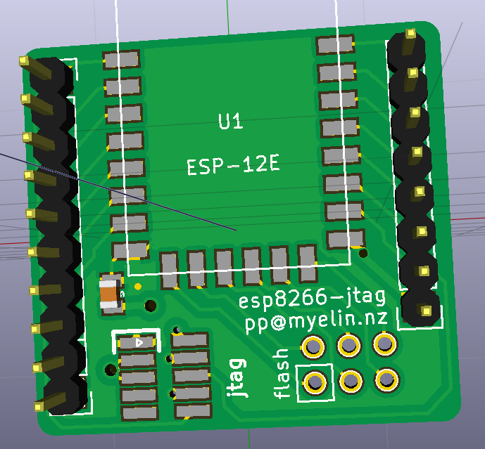
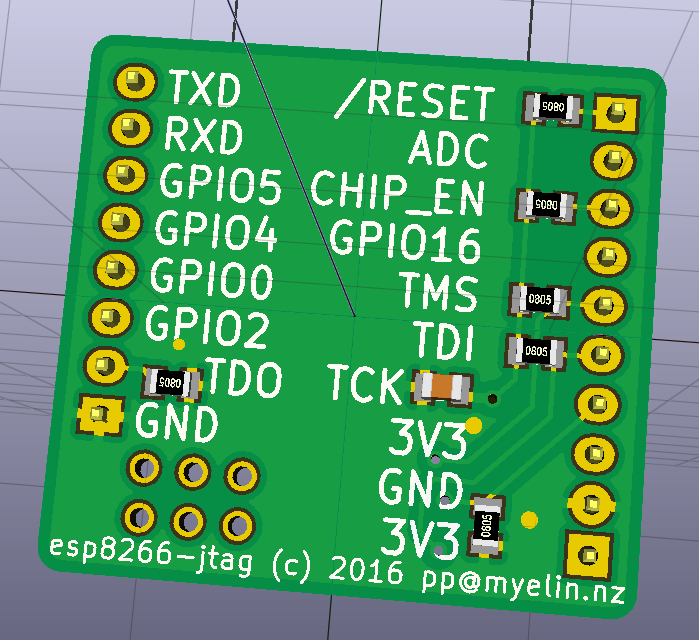

# esp8266-jtag

Breakout board for ESP8266 ESP-12E module, with JTAG support.

Blog post: http://www.myelin.co.nz/post/2016/2/6/#201602061

I haven't built any of these yet, so you might want to ping me for an update before making one yourself, just in case I screwed up the footprints or pinout.

