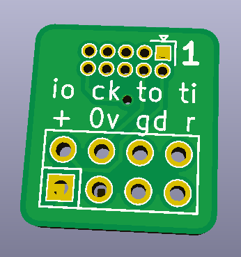

# swd-to-wires

An SWD connector, with the important signals broken out.  Convenient for:

- hooking your J-Link up to an SWD cable, if you don't have a proper adapter

- bringing out signals to an SWD connector from some hacked hardware (Amazon Dash button, etc)

- hacking up an SWD probe using an Arduino or Teensy

